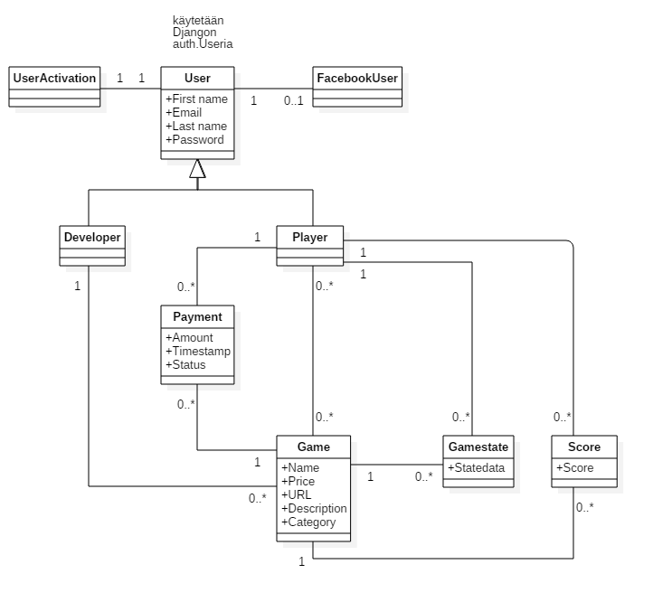
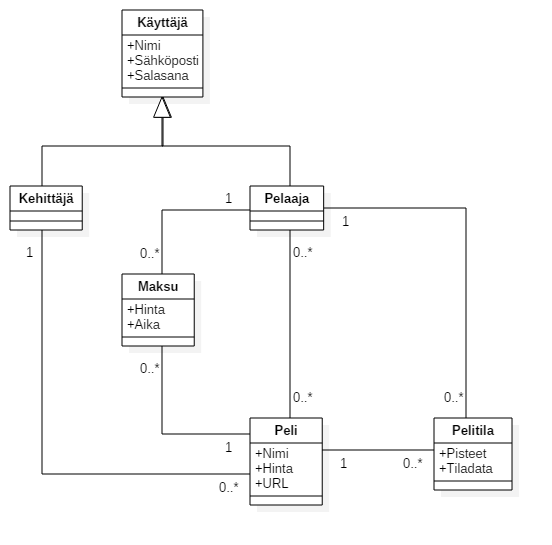

Kurssin lopputyö ttyllä.
-------------------------------

Lopullinen mallien luokkakaavio
-------------------------------

Osoite ja tunnukset
-------------------

riistokauppa.herokuapp.com

Esimerkkipelaajatilit:

Käyttäjätunnus: pelaaja 
Salasana: pel1

Käyttäjätunnus: pp 
Salasana: pp

Esimerkkikehittäjätilit:

Käyttäjätunnus: devaaja 
Salasana: dev1

Käyttäjätunnus: kapu 
Salasana: testi

API:

/highscore

Urlit palvelun pelien pistelistauksiin

/highscore/:id

Id:n mukaisen pelin pistelistaus

Projektisuunnitelma
===================
Tavoitteenamme on saada 1100 pistettä.  Toteutamme seuraavat ominaisuudet:

Autentikaatio
-------------
Rekisteröinnissä käytetään sähköpostitunnistautumista käyttäen Django Console Backendiä.
Rekisteröinnin yhteydessä käyttäjä valitsee onko hän kehittäjä vai pelaaja. Salasana tallennetaan
tietokantaan tiivisteenä. Tämän jälkeen käyttäjätunnus ja salasana noudetaan POSTilla.
Käyttäjän annetaan myös autentikoitua kolmannen osapuolen palvelun kautta.

Näkymät: rekisteröityminen, kirjautuminen

Mallit: Pelaaja, Kehittäjä

Pelaajan perustoiminnot
-----------------------
Pelaaja voi ostaa, etsiä ja pelata pelejä. Pelin sivulle mennessään tarkistetaan
onko hän ostanut pelin ja siirretään ostosivulle, jos peliä ei ole ostettu.
Maksuliikenne hoidetaan annetun, kirjoitushetkellä määrittelemättömän maksupalvelun kautta.
Maksutapahtumat talletetaan erilliseen malliin, koska pelin hinta voi muuttua. Pelejä voi tarkastella kategorioittain tai haun kautta.

Näkymät: Esittelysivu ja pelaussivu jokaiselle pelille, hakusivu, pääsivu

Mallit: Peli, Pelaaja, Maksuliikenne

Kehittäjän perustoiminnot
-------------------------
Kehittäjä voi lisätä, muokata ja poistaa omia pelejään. Lisätessä asetetaan hinta,
jota voi muokata myöhemmin. Kehittäjällä on myös infosivu, joka kertoo pelimyynnistä
ja sisältää inventaarion peleistä. Poistettaessa ja muokatessa tarkastetaan, että kehittäjällä on oikeudet toimenpiteeseen.

Näkymät: pelin lisäys, infosivu, pelin muokkaus

Mallit: Peli, Kehittäjä

Pelin ja palvelun rajapinta
---------------------------
Peli ja palvelu kommunikoivat ohjeessa annetulla protokollalla (postMessage).
Peli lähettää palvelulle tietoa saaduista pisteistä. Palvelu lisää pisteet pelaajan tuloksiin ja globaaliin listaukseen.
Pisteet talletetaan Pelitila-malliin, jota voitaisiin käyttää myös jos haluttaisiin toteuttaa pelin tallennus ja lataus.

Näkymät: Pelin pelausnäkymä

Mallit: Peli, Pelaaja, Pelitila

Laatu
-----
Käytetään järkeviä nimeämiskäytäntöjä, koodataan ja kommentoidaan englanniksi.
Käyttäjäkokemukseen panostetaan jos jää aikaa. Toiminnallisuutta testataan intensiivisesti.
Varmistetaan myös että sovellus toimii yleisimmilllä selaimilla ja testataan yleisimmät tietoturvariskit.

Ei-toiminnaliset vaatimukset
----------------------------
Projektityökaluina käytetään Trelloa ja GitLabia. Ryhmän kesken tavataan kahden viikon välein.
Kommunikaatiovälineenä käytetään myös WhatsAppia. Dediksen lähestyessä tarkastamme tapaamisväliä.

Sosiaalinen media
-----------------
Lisäämme peleille sosiaalisen median mainostusnapit.

REST-rajapinta
--------------
Toteutetaan ainakin yksinkertainen rajapinta josta saa yleistä tietoa palvelusta ja joka ei vaadi autentikaatiota.

Kolmannen osapuolen autentikaatio
--------------------------------
Ks. Autentikaatio

Responsiivisuus
---------------
Käyttäjän tullessa sivulle tarkastetaan selaimen resoluutio ja CSS-tyyleillä muokataan sivusto resoluutioon sopivaksi.
Kosketusnäytöt otetaan huomioon tekemällä napeista helposti tökättäviä.

Oma peli
--------
Jos jää aikaa toteutamme oman pelin.

Mallit
------
Seuraavassa kuvassa on esitetty käytettävien mallien suhteet ja mallien sisältämät ominaisuudet.

